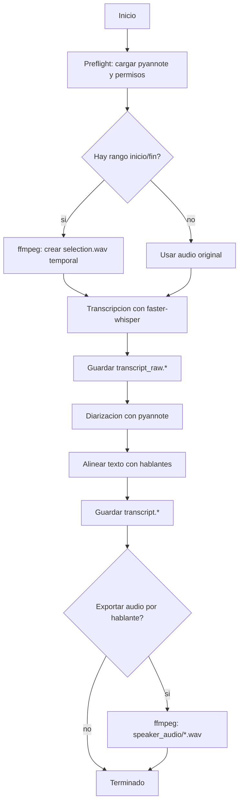

# Documentacion Completa de Meeting Transcriber

Esta documentacion describe el funcionamiento completo de la aplicacion para dos publicos:

- Personas que quieren usar, mantener o distribuir la aplicacion.
- LLMs o agentes de codigo que necesitan entender rapidamente la arquitectura, los flujos, los contratos internos y los puntos de extension.

La aplicacion esta escrita en Python, usa una interfaz Tkinter y procesa audio localmente con `faster-whisper`, `pyannote.audio` e `ffmpeg` embebido mediante `imageio-ffmpeg`.

## Resumen Ejecutivo

Meeting Transcriber es una aplicacion de escritorio para convertir audios o videos largos de reuniones en transcripciones separadas por hablante.

Objetivos principales:

- Funcionamiento local para transcripcion y diarizacion.
- Facilidad de uso para usuarios no tecnicos.
- Instalacion guiada sin que el usuario ejecute comandos manuales de dependencias.
- Soporte Windows y Linux.
- Procesamiento de audios largos mediante rangos de inicio y fin.
- Guardado de resultados parciales para no perder horas de trabajo.
- Historial visual de cobertura para evitar reprocesar rangos ya completados.
- Recomendacion automatica del siguiente fragmento segun velocidad de procesamiento reciente.
- Renombrado posterior de hablantes.
- Memoria de hablantes entre fragmentos para mantener nombres coherentes.
- Integracion opcional con `opencode` o `codex` para proponer nombres reales de hablantes.

No objetivos actuales:

- No es una aplicacion web.
- No empaqueta todavia un `.exe`.
- No garantiza diarizacion perfecta en audio malo, con ruido o con muchas voces superpuestas.
- No evita toda conexion a internet durante la primera preparacion, porque necesita instalar dependencias y descargar modelos si no estan cacheados.

## Como Arranca la Aplicacion

Hay tres lanzadores:

- `run_app.bat`: Windows con `py scripts\bootstrap.py`.
- `run_app.ps1`: Windows PowerShell con `py scripts\bootstrap.py`.
- `run_app.sh`: Linux/macOS-like shell con `python scripts/bootstrap.py`.

Todos delegan en:

```text
scripts/bootstrap.py
```

### Bootstrap

`scripts/bootstrap.py` realiza estas tareas:

1. Calcula la ruta del proyecto y de `.venv`.
2. Construye el entorno de ejecucion local:
   - `MPLCONFIGDIR=<proyecto>/.cache/matplotlib`
   - `HF_HOME=<proyecto>/models/huggingface`
3. Comprueba si el entorno ya esta listo.
4. Si esta listo, abre directamente:

   ```bash
   python -m meeting_transcriber
   ```

5. Si no esta listo, muestra un instalador guiado.
6. Crea `.venv` si no existe.
7. Instala o actualiza:
   - `pip`
   - `wheel`
   - `setuptools`
   - el paquete local del proyecto
8. En Linux instala ademas librerias CUDA locales para `faster-whisper`:
   - `nvidia-cublas-cu12`
   - `nvidia-cudnn-cu12`
9. Comprueba `imageio_ffmpeg.get_ffmpeg_exe()`.
10. Prepara el modelo Whisper por defecto cargando `WhisperModel('small', device='cpu', compute_type='int8')`.
11. Abre la aplicacion.

### Criterio de Entorno Listo

`_environment_ready` comprueba que:

- existe el Python de `.venv`
- se puede importar `meeting_transcriber`
- se puede importar `faster_whisper`
- se puede importar `pyannote.audio`
- se puede importar `imageio_ffmpeg`
- en Linux se pueden importar paquetes NVIDIA locales
- `configure_cuda_runtime()` no falla
- `imageio_ffmpeg.get_ffmpeg_exe()` funciona

Si algo falla, el instalador se ejecuta de nuevo.

## Estructura del Repositorio

```text
.
├── README.md
├── docs/
│   └── FUNCIONAMIENTO.md
├── pyproject.toml
├── run_app.bat
├── run_app.ps1
├── run_app.sh
├── scripts/
│   ├── __init__.py
│   └── bootstrap.py
├── src/
│   └── meeting_transcriber/
│       ├── __main__.py
│       ├── audio.py
│       ├── benchmark.py
│       ├── cancellation.py
│       ├── cli.py
│       ├── config.py
│       ├── cuda_runtime.py
│       ├── diarization.py
│       ├── diarization_models.py
│       ├── diarization_quality.py
│       ├── exporters.py
│       ├── external_links.py
│       ├── ffmpeg.py
│       ├── gui.py
│       ├── hf_auth.py
│       ├── history.py
│       ├── languages.py
│       ├── pipeline.py
│       ├── progress.py
│       ├── runtime.py
│       ├── speaker_ai.py
│       ├── speaker_fingerprints.py
│       ├── speaker_memory.py
│       ├── speaker_names.py
│       ├── time_range.py
│       ├── transcription.py
│       ├── types.py
│       └── whisper_models.py
└── tests/
```

Directorios generados e ignorados:

- `.venv/`: entorno Python local.
- `.cache/`: caches locales, especialmente Matplotlib.
- `models/`: cache de Hugging Face.
- `output/`: resultados de transcripcion.
- `build/`, `dist/`, `*.egg-info`.

## Dependencias Principales

Declaradas en `pyproject.toml`:

```toml
dependencies = [
    "faster-whisper>=1.0.0",
    "imageio-ffmpeg>=0.5.0",
    "pyannote.audio>=3.3.0",
]
```

Uso de cada una:

- `faster-whisper`: transcripcion ASR y timestamps de palabra.
- `pyannote.audio`: diarizacion, es decir, separacion de voces por hablante.
- `imageio-ffmpeg`: ffmpeg embebido sin pedir al usuario que instale ffmpeg global.

Dependencias transitivas importantes:

- `torch` y `torchaudio` via `pyannote.audio`.
- `ctranslate2` via `faster-whisper`.
- paquetes NVIDIA locales en Linux si se usa CUDA.

## Modelo de Datos Interno

Definido en `src/meeting_transcriber/types.py`.

### TranscriptWord

Representa una palabra con timestamp:

```python
TranscriptWord(start: float, end: float, text: str)
```

Se usa cuando la calidad de diarizacion requiere alineacion por palabra.

### TranscriptSegment

Representa un segmento de Whisper:

```python
TranscriptSegment(
    start: float,
    end: float,
    text: str,
    words: tuple[TranscriptWord, ...] = (),
)
```

Si `words` esta vacio, la asignacion de hablante se hace por solapamiento del segmento completo.

### DiarizationSegment

Representa un tramo de voz detectado por pyannote:

```python
DiarizationSegment(start: float, end: float, speaker: str)
```

`speaker` suele ser una etiqueta tecnica de pyannote, por ejemplo `SPEAKER_00`.

### ConversationTurn

Representa el resultado final de texto atribuido a un hablante:

```python
ConversationTurn(start: float, end: float, speaker: str, text: str)
```

Este es el objeto que exportan `transcript.md`, `transcript.txt`, `transcript.srt` y `transcript.json`.

### ProcessingConfig

Contrato central de configuracion de procesamiento:

```python
ProcessingConfig(
    whisper_model: str,
    diarization_model: str,
    huggingface_token: str | None,
    ffmpeg_path: Path | None,
    language: str | None,
    min_speakers: int | None,
    max_speakers: int | None,
    device: str,
    compute_type: str,
    export_speaker_audio: bool,
    start_seconds: float | None = None,
    end_seconds: float | None = None,
    diarization_quality: str = "precise",
)
```

Valores habituales:

- `device`: `"cpu"` o `"cuda"`.
- `compute_type`: `"int8"`, `"int8_float16"`, `"float16"` o `"float32"`.
- `language`: `None` para deteccion automatica o codigos como `"ca"`, `"es"`, `"en"`.
- `diarization_quality`: `"fast"`, `"precise"` o `"strict"`.

## Configuracion Persistida

La configuracion se guarda en:

- Windows: `%APPDATA%/MeetingTranscriber/config.json`
- Linux: `$XDG_CONFIG_HOME/meeting-transcriber/config.json`
- Si no hay `XDG_CONFIG_HOME`: `~/.config/meeting-transcriber/config.json`

El historial se guarda junto a la configuracion:

```text
history.json
```

La memoria de hablantes se guarda junto a la configuracion:

```text
speaker_memory.json
```

### UiState

El estado de UI persistido actualmente contiene:

- `last_audio_dir`: ultima carpeta desde la que se selecciono un audio.

Esto permite que el selector de archivo vuelva a abrirse en la carpeta usada anteriormente.

### Migraciones Suaves

`config.py` conserva compatibilidad parcial con configuraciones antiguas:

- Si no existe `whisper_model`, usa `DEFAULT_WHISPER_MODEL`.
- Si no existe `diarization_model`, usa `DEFAULT_DIARIZATION_MODEL`.
- Si no existe `diarization_quality`, usa `DEFAULT_DIARIZATION_QUALITY`.

## Interfaz Grafica

La interfaz esta implementada en `src/meeting_transcriber/gui.py` con Tkinter.

Ventana principal:

- Titulo: `Meeting Transcriber`.
- Tamaño inicial: `1120x800`.
- Minimo: `900x680`.
- Polling de eventos de worker threads cada 200 ms.

### Campos Principales

`Audio`

- Ruta del archivo de entrada.
- Boton `Elegir`.
- Formatos filtrados: `.wav`, `.mp3`, `.m4a`, `.mp4`, `.aac`, `.flac`, `.ogg`.
- Tambien permite `Todos`.
- Al elegir archivo:
  - se actualiza `audio_path`
  - se guarda `last_audio_dir`
  - se guarda la configuracion
  - se refresca el historial

`Salida`

- Carpeta de salida.
- Por defecto: `<cwd>/output`.
- Actua como carpeta base.
- Cada procesamiento crea una subcarpeta por audio y rango para evitar sobrescrituras.
- Formato habitual:

  ```text
  <salida>/<audio_sanitizado>/<HH-MM-SS_to_HH-MM-SS>/
  ```

- Si la carpeta ya existe, se añade sufijo `_2`, `_3`, etc.

`Calidad`

Se muestra en una fila compacta junto a `Diarizacion`, `Separacion voces` e `Idioma`.

Mapea etiquetas humanas a modelos Whisper:

| Etiqueta UI | Modelo interno |
|---|---|
| Rapido | `base` |
| Equilibrado | `small` |
| Preciso | `medium` |
| Maxima precision | `large-v3` |

`Diarizacion`

Actualmente solo tiene:

| Etiqueta UI | Modelo interno |
|---|---|
| Automatico | `pyannote/speaker-diarization-community-1` |

`Separacion voces`

Mapea calidad de diarizacion:

| Etiqueta UI | ID interno | Comportamiento |
|---|---|---|
| Rapida | `fast` | No fuerza timestamps por palabra. |
| Precisa | `precise` | Activa timestamps por palabra y alineacion fina. |
| Muy precisa | `strict` | Igual que precisa y ademas intenta parametros mas estrictos en pyannote. |

`Idioma`

Mapea nombres humanos a codigos:

| Etiqueta UI | Codigo |
|---|---|
| Deteccion automatica | `None` |
| Catala | `ca` |
| Espanol | `es` |
| English | `en` |
| Francais | `fr` |
| Deutsch | `de` |
| Italiano | `it` |
| Portugues | `pt` |

`Hablantes`

- `Min`: minimo de hablantes esperado.
- `Max`: maximo de hablantes esperado.
- En blanco significa `None`.
- Deben ser enteros mayores que cero.
- Ayudan mucho en reuniones con muchas personas.

`Rango`

Entrada por spinboxes:

- Inicio: horas, minutos, segundos.
- Fin: horas, minutos, segundos.

Regla:

- `0 h 0 m 0 s` se interpreta como vacio.
- Si inicio y fin estan vacios, se procesa todo el archivo.
- Si ambos existen, `Fin` debe ser posterior a `Inicio`.

`Ejecucion`

- `device`: `cpu` o `cuda`.
- `compute_type`: `int8`, `int8_float16`, `float16`, `float32`.

`Exportar audio separado por hablante`

- Si esta activo, tras la transcripcion final se crean audios por hablante en `speaker_audio/`.
- Es experimental porque depende de la calidad de diarizacion.

`Token HF`

- Campo con `show="*"`.
- Se usa para acceder a modelos de Hugging Face.
- Botones:
  - `Abrir modelo pyannote`: abre `https://huggingface.co/pyannote/speaker-diarization-community-1`.
  - `Crear token HF`: abre `https://huggingface.co/settings/tokens`.

### Botones de Accion

`Procesar`

- Valida configuracion y archivo.
- Guarda configuracion.
- Limpia vista previa y registro.
- Lanza `_run_processing` en un thread.

`Probar rendimiento`

- Valida configuracion y archivo.
- Lanza benchmark de 30 segundos.
- Prueba candidatos CPU/CUDA.
- Aplica la recomendacion ganadora.

`Detener`

- Activa una cancelacion cooperativa.
- Desactiva el propio boton.
- Actualiza estado a `Deteniendo proceso...`.
- No mata violentamente el proceso Python.
- Puede tardar en responder si una libreria esta dentro de una llamada pesada.

`Renombrar hablantes`

- Abre dialogo para cambiar `Persona N` por nombres reales.
- Se habilita tras tener transcripcion final o al cargar `transcript.json` desde la salida.

`Guardar configuracion`

- Persiste `ProcessingConfig` y `UiState`.

### Paneles Inferiores

`Historial de este audio`

- Lista los rangos completados previamente para el audio seleccionado.
- Usa `history.json`.
- Muestra una barra de cobertura con los rangos ya procesados.
- Fusiona rangos adyacentes o solapados para calcular cobertura real.
- Calcula la duracion del audio con ffmpeg.
- Calcula velocidad reciente a partir de fragmentos validados.
- Recomienda el siguiente hueco a procesar segun la tanda objetivo (`10 min`, `15 min`, `30 min`).
- El boton `Usar recomendado` rellena inicio y fin.
- Permite abrir la carpeta de salida del fragmento seleccionado.
- Permite eliminar una entrada del historial.
- Al eliminar, el usuario decide si solo quita el historial o tambien borra archivos generados.
- No borra archivos si la carpeta aparece referenciada por otros fragmentos.

Cuando un procesamiento termina, la app muestra un dialogo:

- `Guardar como valido`: añade el rango al historial y alimenta cobertura/velocidad.
- `Descartar y eliminar`: no lo añade al historial y borra artefactos generados si no estan compartidos.
- `Revisar carpeta`: abre la carpeta de salida antes de decidir.

Artefactos que puede eliminar al descartar:

- `transcript.md`, `transcript.txt`, `transcript.json`, `transcript.srt`
- `transcript_raw.md`, `transcript_raw.txt`, `transcript_raw.json`, `transcript_raw.srt`
- `speaker_audio/`
- `speaker_audio_parts/`

`Memoria de hablantes`

- Usa `speaker_memory.json`.
- Guarda nombres validados por archivo de audio.
- Guarda rangos de muestra por hablante.
- Guarda embeddings/huellas de voz cuando se pueden extraer.
- El dialogo de renombrado muestra nombres conocidos como sugerencias.
- Al completar un nuevo fragmento, intenta aplicar nombres recordados antes de guardar/validar.
- Si hay huellas, compara por similitud de voz.
- Si no hay huellas, aplica nombres solo cuando el numero de hablantes coincide exactamente.
- Si la extraccion de huellas falla, la app sigue usando memoria de nombres.

`Vista previa`

- Durante transcripcion muestra segmentos en vivo:

  ```text
  [00:01:05] Texto del segmento...
  ```

- No usa doble linea entre segmentos.

`Registro`

- Muestra eventos de proceso, benchmark, diarizacion, errores e IA.

## Modelo de Eventos y Progreso

La comunicacion entre threads de trabajo y UI usa:

```python
self.events: queue.Queue[tuple[str, Any]]
```

El hilo de UI consume eventos en `_poll_events` cada 200 ms.

### ProgressEvent

Definido en `progress.py`:

```python
ProgressEvent(
    stage: str,
    message: str,
    seconds: float | None = None,
    duration_seconds: float | None = None,
    elapsed_seconds: float | None = None,
    text_chars: int | None = None,
    segments: int | None = None,
    speakers: int | None = None,
    summary: str | None = None,
    text: str | None = None,
    completed: int | None = None,
    total: int | None = None,
)
```

### Stages Usados

| Stage | Uso |
|---|---|
| `preflight` | Cargando modelos y comprobando permisos. |
| `preflight_done` | Modelos listos. |
| `prepare` | Preparando recorte de audio. |
| `transcription` | Progreso agregado de transcripcion. |
| `transcription_segment` | Segmento nuevo para vista previa. |
| `transcription_done` | Whisper completo. |
| `export` | Guardando resultados. |
| `diarization` | Inicio de separacion de voces. |
| `diarization_progress` | Progreso interno de pyannote. |
| `diarization_done` | Diarizacion cruda lista. |
| `alignment` | Alineando texto con hablantes. |
| `alignment_done` | Turnos finales generados. |
| `speaker_audio` | Exportando audios separados. |
| `done` | Proceso terminado. |
| `benchmark` | Progreso de benchmark. |

### Progreso de Transcripcion

`format_transcription_progress` muestra:

- tiempo procesado
- duracion total cuando Whisper la informa
- velocidad en `x`
- ETA aproximada
- numero de segmentos
- numero de caracteres

Ejemplo:

```text
Transcribiendo audio: 00:01:05 / 01:59:49, 1.5x, ETA 01:18:20, 21 segmentos, 750 caracteres
```

### Progreso de Diarizacion

pyannote recibe un `hook`.

Si informa `completed` y `total`, la UI cambia la barra a modo determinado.

Pasos traducidos:

| Paso pyannote | Texto UI |
|---|---|
| `segmentation` | Separando voces: analizando actividad de voz |
| `speaker_counting` | Separando voces: estimando hablantes simultaneos |
| `embeddings` | Separando voces: comparando huellas de voz |
| `discrete_diarization` | Separando voces: reconstruyendo turnos |

## Pipeline Principal

Implementado en `pipeline.py`.

Funcion principal:

```python
process_meeting(audio_path, output_dir, config, progress=None, cancelled=None)
```

Flujo:



Detalles importantes:

1. Carga pyannote antes de transcribir.
   - Evita esperar horas para fallar al final por token o permisos.
2. Si hay rango, crea un WAV mono 16 kHz temporal.
3. Transcribe con Whisper.
4. Guarda siempre `transcript_raw.*` antes de diarizar.
5. Si falla la diarizacion, guarda `transcript.*` sin diarizar y relanza el error.
6. Si la diarizacion funciona, alinea texto y hablantes.
7. Exporta los resultados finales.
8. Opcionalmente exporta audio por hablante.

## Transcripcion

Implementada en `transcription.py`.

Funcion:

```python
transcribe_audio(audio_path, config, progress=None, cancelled=None)
```

Pasos:

1. Llama a `configure_cuda_runtime()`.
2. Importa `WhisperModel` desde `faster_whisper`.
3. Aplica token HF si existe.
4. Crea el modelo:

   ```python
   WhisperModel(
       config.whisper_model,
       device=config.device,
       compute_type=config.compute_type,
       use_auth_token=config.huggingface_token,
   )
   ```

5. Llama a:

   ```python
   model.transcribe(
       str(audio_path),
       language=config.language,
       vad_filter=True,
       word_timestamps=uses_word_alignment(config.diarization_quality),
   )
   ```

6. Por cada segmento:
   - comprueba cancelacion
   - crea `TranscriptSegment`
   - si hay timestamps de palabra, crea `TranscriptWord`
   - emite eventos de preview y progreso

### Modelos Whisper

Definidos en `whisper_models.py`.

| ID | Etiqueta |
|---|---|
| `base` | Rapido |
| `small` | Equilibrado |
| `medium` | Preciso |
| `large-v3` | Maxima precision |

Default:

```python
DEFAULT_WHISPER_MODEL = "small"
```

### Manejo de OOM

Si el error contiene `out of memory`, se convierte a mensaje amigable:

```text
CUDA se quedo sin memoria durante la transcripcion. Usa 'Probar rendimiento' para autoconfigurar o cambia a CPU / int8.
```

## Diarizacion

Implementada en `diarization.py`.

Modelo por defecto:

```text
pyannote/speaker-diarization-community-1
```

### Preflight

`load_diarization_pipeline(config)`:

1. Llama a `configure_cuda_runtime()`.
2. Importa `Pipeline` desde `pyannote.audio`.
3. Aplica token HF si existe.
4. Ejecuta:

   ```python
   Pipeline.from_pretrained(config.diarization_model, token=config.huggingface_token)
   ```

5. Configura runtime:
   - si `device == "cuda"`, intenta `pipeline.to(torch.device("cuda"))`
   - si falla, no aborta; puede ejecutarse en CPU
   - si `diarization_quality == "strict"`, intenta `pipeline.instantiate(...)`

### Parametros de Hablantes

Cuando existen:

- `min_speakers` se pasa como `min_speakers`.
- `max_speakers` se pasa como `max_speakers`.

Esto guia el clustering de pyannote.

### Calidad `strict`

Si el pipeline acepta `instantiate`, se intentan parametros:

```python
{
    "segmentation": {"min_duration_off": 0.0},
    "clustering": {"threshold": 0.5, "Fa": 0.07, "Fb": 0.8},
}
```

Si el pipeline no acepta esos parametros, se ignora silenciosamente.

### Fallback CUDA a CPU

Si `device == "cuda"` y pyannote falla con un error que parece CUDA/NVRTC/CUBLAS/OOM:

1. Emite progreso:

   ```text
   CUDA fallo; reintentando separacion de voces en CPU
   ```

2. Mueve pipeline a CPU.
3. Reintenta diarizacion.

### Formatos de Salida de pyannote

`_annotation_from_diarization_output` soporta:

1. Salida legacy con `itertracks`.
2. `exclusive_speaker_diarization`.
3. `speaker_diarization`.

Si no encuentra un formato compatible, lanza `TypeError`.

## Alineacion Texto-Hablante

Implementada en `pipeline.py`.

Hay dos modos.

### Modo Segmento

Si `TranscriptSegment.words` esta vacio:

1. Para cada segmento de Whisper se calcula el solapamiento con cada segmento de diarizacion.
2. Se elige el hablante con mayor solapamiento.
3. Etiquetas tecnicas como `SPEAKER_00` se renombran a `Persona 1`, `Persona 2`, etc.
4. Segmentos consecutivos del mismo hablante se fusionan.

### Modo Palabra

Si algun segmento tiene `words`:

1. Para cada palabra se toma el punto medio temporal.
2. Se busca el segmento de diarizacion que contiene ese punto.
3. Si no hay segmento exacto, se acepta el mas cercano hasta 0.5 segundos.
4. Si no hay hablante cercano, se usa el hablante del segmento completo como fallback.
5. Palabras consecutivas del mismo hablante se fusionan si la distancia entre ellas es menor o igual a 1.2 segundos.

Este modo mejora reuniones donde Whisper agrupa varias presentaciones en una misma frase.

## Exportaciones

Implementadas en `exporters.py`.

### Carpeta Efectiva por Procesamiento

La GUI no escribe directamente en la carpeta base elegida en `Salida`.

Antes de lanzar `process_meeting`, calcula:

```python
build_processing_output_dir(base_output_dir, audio_path, start_seconds=..., end_seconds=...)
```

Ejemplo:

```text
output/Taula_Institucional_18_03_26/00-10-00_to_00-20-00/
```

Esto evita que `transcript.*`, `transcript_raw.*` y `speaker_audio/` de un fragmento sobrescriban los de otro.

El historial guarda esta carpeta efectiva, no solo la carpeta base.

`write_all_exports(output_dir, turns, basename="transcript")` genera:

- `<basename>.md`
- `<basename>.txt`
- `<basename>.json`
- `<basename>.srt`

### Markdown

Formato:

```markdown
# Transcripcion

[00:00:01] **Persona 1:** Texto...
```

### Texto Plano

Formato:

```text
[00:00:01] Persona 1: Texto...
```

### JSON

Formato:

```json
{
  "turns": [
    {
      "start": 1.23,
      "end": 4.56,
      "speaker": "Persona 1",
      "text": "Texto..."
    }
  ]
}
```

### SRT

Formato:

```text
1
00:00:01,230 --> 00:00:04,560
Persona 1: Texto...
```

## Transcripcion Bruta

Siempre se intenta guardar:

```text
transcript_raw.md
transcript_raw.txt
transcript_raw.json
transcript_raw.srt
```

Esto ocurre despues de Whisper y antes de pyannote.

Motivo:

- Si pyannote falla, no se pierde el tiempo invertido en transcribir.

Los turnos brutos usan:

```text
Sin diarizar
```

como hablante.

## Exportacion de Audio por Hablante

Implementada en `audio.py`.

Flujo:

1. `build_speaker_extract_plan` agrupa `ConversationTurn` por hablante.
2. Para cada hablante se genera un plan con segmentos.
3. `_export_one_speaker`:
   - corta cada segmento con ffmpeg
   - guarda partes temporales en `<speaker>_parts/`
   - crea `concat.txt`
   - concatena las partes en `<speaker>.wav`

Salida:

```text
speaker_audio/Persona_1.wav
speaker_audio/Persona_2.wav
```

Limitaciones:

- Si la diarizacion se equivoca, los audios por hablante heredan ese error.
- Los silencios entre turnos se pierden porque se concatenan fragmentos.

## Memoria y Huellas de Hablantes

Implementada en:

- `speaker_memory.py`
- `speaker_fingerprints.py`
- integracion en `gui.py`

### SpeakerMemory

`speaker_memory.py` define:

```python
SpeakerIdentity(
    name: str,
    sample_ranges: tuple[tuple[float, float], ...],
    embeddings: tuple[tuple[float, ...], ...] = (),
)

SpeakerMemory(
    audios: dict[str, list[SpeakerIdentity]],
)
```

La clave de `audios` es la ruta del archivo de audio original.

### Cuando se Guarda Memoria

La memoria se actualiza cuando el usuario guarda nombres en `Renombrar hablantes`.

1. `_speaker_names_saved` recibe los `ConversationTurn` ya renombrados.
2. `remember_validated_turns` guarda nombres y rangos de muestra.
3. En segundo plano, la app intenta extraer embeddings de voz.
4. Si la extraccion funciona, se añaden a `speaker_memory.json`.
5. Si falla, no se bloquea la UI y la memoria de nombres sigue siendo valida.

No se guardan como identidades las etiquetas genericas:

- `SPEAKER_*`
- `Persona N`

### Uso en Fragmentos Posteriores

Al terminar un nuevo procesamiento:

1. Se carga `speaker_memory.json`.
2. Si existen embeddings guardados:
   - se extraen embeddings del fragmento nuevo
   - se comparan con `cosine_similarity`
   - se asigna cada nombre conocido como maximo una vez
   - el umbral actual es `0.8`
3. Si no hay match por huella, se usa fallback conservador:
   - solo si todas las etiquetas son `Persona N`
   - solo si el numero de hablantes detectados coincide con el numero de nombres conocidos
4. Si se aplica un mapping, se reescriben `transcript.*` antes de pedir validacion.

Este flujo evita asumir coincidencias cuando hay ambiguedad.

### Extraccion de Embeddings

`speaker_fingerprints.py` usa:

```python
DEFAULT_EMBEDDING_MODEL = "pyannote/embedding"
```

`load_pyannote_embedding_extractor`:

1. Configura runtime CUDA local.
2. Aplica token HF si existe.
3. Carga `Model.from_pretrained(DEFAULT_EMBEDDING_MODEL, token=...)`.
4. Crea `Inference(model, window="whole")`.
5. Si `device == "cuda"`, intenta usar `torch.device("cuda")`.

`PyannoteEmbeddingExtractor`:

1. Recorta cada muestra con `extract_audio_range`.
2. Ejecuta inferencia sobre el clip temporal.
3. Normaliza la salida a `tuple[float, ...]`.

`extract_speaker_embeddings`:

- Ignora turnos de menos de 2 segundos.
- Usa como maximo 3 muestras por hablante.
- Promedia embeddings compatibles por hablante.

### Persistencia

Ejemplo simplificado de `speaker_memory.json`:

```json
{
  "audios": {
    "/audio/reunion.m4a": [
      {
        "name": "Ruben",
        "sample_ranges": [[0.0, 5.0], [12.0, 18.0]],
        "embeddings": [[0.12, -0.04, 0.33]]
      }
    ]
  }
}
```

## Rangos de Audio

Implementados en:

- `time_range.py`
- `audio.py`
- `pipeline.py`

La UI usa spinboxes H/M/S.

La CLI acepta:

- segundos: `90`
- `MM:SS`: `01:30`
- `HH:MM:SS`: `00:01:30`

`extract_audio_range` usa ffmpeg:

- `-ss` si hay inicio
- `-to` si hay fin sin inicio
- `-t` si hay inicio y fin
- salida mono:
  - `-ac 1`
  - `-ar 16000`

Si se procesa un rango, los timestamps finales se desplazan con `offset_seconds` para que sigan referidos al audio original.

## Benchmark y Autoconfiguracion

Implementado en `benchmark.py`.

Funcion principal:

```python
run_transcription_benchmark(audio_path, config, seconds=30.0, progress=None, cancelled=None)
```

Flujo:

1. Comprueba archivo.
2. Detecta CUDA con `detect_cuda()`.
3. Recorta un clip de 30 segundos desde `config.start_seconds` o 0.
4. Prueba candidatos:

Si CUDA esta disponible:

```text
cuda / float32
cuda / float16
cuda / int8_float16
cuda / int8
cpu / float32
cpu / int8
```

Si CUDA no esta disponible:

```text
cpu / float32
cpu / int8
```

5. Mide velocidad:

```python
speed = audio_seconds / elapsed_seconds
```

6. Recomienda el candidato exitoso mas rapido.
7. La GUI aplica automaticamente `device` y `compute_type`.

### Deteccion CUDA

Primero se prueba `ctranslate2.get_cuda_device_count()`.

Si falla, se consulta PyTorch como diagnostico secundario.

### Limpieza de Memoria CUDA

Tras cada intento:

```python
torch.cuda.empty_cache()
```

si torch esta disponible.

## CUDA y Librerias Embebidas

Implementado en `cuda_runtime.py`.

Objetivo:

- Exponer librerias NVIDIA instaladas dentro de `.venv` para que `faster-whisper`, `ctranslate2`, PyTorch y pyannote las encuentren.

Proceso:

1. Busca rutas `nvidia/*/lib` dentro de `sys.path`.
2. Las antepone a:
   - `LD_LIBRARY_PATH`
   - `PATH`
3. En Linux precarga con `ctypes.CDLL(..., RTLD_GLOBAL)`:
   - `libnvrtc-builtins.so.13.0`
   - `libnvrtc.so.13`
   - `libcublas.so.13`
   - `libcublasLt.so.13`
   - `libnvrtc.so.12`
   - `libnvrtc-builtins.so.12.9`
   - `libcublas.so.12`
   - `libcublasLt.so.12`
   - `libcudnn.so.9`

`configure_cuda_runtime()` es idempotente mediante `_CONFIGURED`.

## Token de Hugging Face

Implementado en `hf_auth.py`.

Si hay token:

```python
os.environ["HF_TOKEN"] = token
os.environ["HUGGING_FACE_HUB_TOKEN"] = token
```

Se aplica antes de:

- crear modelo Whisper
- cargar pipeline pyannote

La UI lo guarda en configuracion local. No debe subirse a Git.

## Historial de Fragmentos

Implementado en `history.py`.

Formato conceptual:

```json
{
  "entries": {
    "/ruta/audio.m4a": [
      {
        "start_seconds": 0.0,
        "end_seconds": 120.0,
        "output_dir": "/ruta/output"
      }
    ]
  }
}
```

Se usa para mostrar en la UI que partes de un audio ya fueron procesadas.

No evita procesar dos veces el mismo rango; solo informa.

## Cancelacion

Implementada en `cancellation.py`.

Contrato:

```python
CancelCheck = Callable[[], bool]
```

La GUI usa:

```python
self._cancel_event = threading.Event()
```

Cuando el usuario pulsa `Detener`, se activa el evento.

Las funciones llaman a:

```python
raise_if_cancelled(cancelled)
```

en puntos seguros.

Limitaciones:

- No puede interrumpir instantaneamente una llamada interna larga de Whisper, pyannote o ffmpeg.
- Corta entre segmentos, fases o procesos externos cuando el control vuelve a Python.
- En procesos externos de IA se intenta `terminate`, luego `kill`.

## Renombrado de Hablantes

Implementado en:

- `speaker_names.py`
- dialogo `SpeakerNameDialog` en `gui.py`
- `speaker_ai.py` para IA opcional

### Renombrado Manual

`SpeakerNameDialog`:

1. Lista hablantes (`Persona 1`, `Persona 2`, etc.).
2. Muestra una muestra de texto por hablante.
3. Permite editar cada nombre.
4. Al guardar:
   - llama a `rename_speakers`
   - regenera `transcript.*`
   - actualiza preview

### Sugerencias por Patrones

`speaker_names.py` contiene extractores por regex para frases como:

- `jo em dic`
- `me llamo`
- `soc`
- `soy`
- patrones con cargos como director/directora/regidor/regidora

Actualmente la UI principal usa sobre todo la via IA, pero estas funciones existen para candidatos locales.

## Deteccion de Nombres con IA

Implementada en `speaker_ai.py`.

Es opcional.

La app considera que hay runner IA si existe en `PATH`:

1. `opencode`
2. `codex`

Orden:

- Primero `opencode`.
- Si no existe, `codex`.

### Prompt

`build_speaker_identification_prompt(turns)`:

- Exporta la transcripcion en Markdown.
- Enumera hablantes actuales.
- Pide JSON estricto:

```json
{
  "speakers": {
    "Persona 1": {
      "name": "Nombre Apellidos",
      "confidence": "alta|media|baja",
      "evidence": "frase breve"
    },
    "Persona 2": {
      "name": null,
      "confidence": "baja",
      "evidence": "motivo"
    }
  }
}
```

Solo se aplican entradas con `name` string no vacio.

### opencode

La app escribe:

```text
speaker_names_prompt.md
```

en la carpeta de salida.

Comando:

```bash
opencode run "Lee el archivo adjunto y responde SOLO con el JSON solicitado." \
  --dir <output_dir> \
  --format default \
  --file <speaker_names_prompt.md>
```

### codex

Comando:

```bash
codex exec --skip-git-repo-check --sandbox read-only -C <output_dir> -
```

El prompt se pasa por stdin.

### Cancelacion IA

`_run_cancellable`:

1. Lanza proceso con `subprocess.Popen`.
2. Ejecuta `communicate` en un thread.
3. Cada 0.5 segundos comprueba cancelacion.
4. Si se cancela:
   - `process.terminate()`
   - espera 5 segundos
   - si sigue vivo, `process.kill()`
   - lanza `CancelledError`

## CLI

Implementada en `cli.py`.

Uso conceptual:

```bash
python -m meeting_transcriber.cli audio.m4a \
  --output output \
  --whisper-model small \
  --diarization-model pyannote/speaker-diarization-community-1 \
  --diarization-quality precise \
  --language ca \
  --min-speakers 8 \
  --max-speakers 15 \
  --device cpu \
  --compute-type int8 \
  --start 00:00:00 \
  --end 00:02:00
```

Nota importante para LLMs:

- La entrada principal de usuario final es la GUI.
- La CLI existe, pero no esta tan pulida como la UI.
- `process_meeting(..., print)` recibe `ProgressEvent`; imprimirlo directamente no formatea como la GUI.

## Formatos y Rutas Importantes

### Entrada

La GUI acepta audio/video:

```text
*.wav *.mp3 *.m4a *.mp4 *.aac *.flac *.ogg
```

ffmpeg puede soportar mas si se selecciona `Todos`.

### Salida Default

```text
<cwd>/output
```

### Configuracion

```text
config.json
history.json
```

en el directorio de configuracion de usuario.

### Cache de Modelos

Por bootstrap/runtime:

```text
models/huggingface
```

mediante `HF_HOME`.

## Flujo Detallado de Uso Humano

1. Abrir `run_app.bat`, `run_app.ps1` o `run_app.sh`.
2. Aceptar el instalador si aparece.
3. Esperar a que descargue dependencias y modelos.
4. Seleccionar audio.
5. Elegir carpeta de salida.
6. Elegir calidad Whisper.
7. Elegir separacion de voces.
8. Elegir idioma.
9. Indicar hablantes min/max si se conoce.
10. Opcionalmente limitar inicio/fin.
11. Pulsar `Probar rendimiento` si no se sabe que configuracion usar.
12. Pulsar `Procesar`.
13. Revisar vista previa y progreso.
14. Al terminar, revisar `transcript.md`.
15. Usar `Renombrar hablantes` si hace falta.
16. Si se acepta propuesta IA, revisar antes de guardar.

## Estrategia de Robustez

La aplicacion intenta ser "a prueba de usuario no tecnico" con estas medidas:

- Instalador guiado.
- Entorno `.venv` local.
- No modifica Python global.
- ffmpeg embebido.
- Descarga/preparacion de modelo Whisper desde el instalador.
- Botones para abrir Hugging Face en la pagina exacta.
- Preflight de pyannote antes de transcribir.
- Guardado de `transcript_raw.*` antes de diarizar.
- Mensajes amigables para errores CUDA/OOM/NVRTC.
- Benchmark que prueba configuraciones hasta encontrar una usable.
- Boton de detener.
- Historial de rangos procesados.
- Ultima carpeta de audio recordada.

## Errores Comunes y Diagnostico

### "Cannot access gated repo"

Causa:

- El usuario no acepto acceso/licencia de pyannote en Hugging Face.
- Token ausente o invalido.

Solucion:

1. Pulsar `Abrir modelo pyannote`.
2. Aceptar acceso.
3. Pulsar `Crear token HF`.
4. Pegar token en la app.
5. Reintentar.

### "CUDA se quedo sin memoria"

Causa:

- GPU sin VRAM suficiente para la combinacion modelo/configuracion.

Soluciones:

- Pulsar `Probar rendimiento`.
- Usar `cpu / int8`.
- Reducir modelo Whisper.
- Procesar un rango mas corto.
- Cerrar otras apps que usan GPU.

### "libnvrtc-builtins.so.13.0"

Causa:

- PyTorch/pyannote intenta compilar un kernel CUDA y no encuentra NVRTC.

Mitigaciones existentes:

- `cuda_runtime.py` intenta exponer y precargar librerias CUDA 13 y 12 locales.
- Si pyannote falla en CUDA, se reintenta en CPU.

### Diarizacion mala o hablantes mezclados

Causas:

- Audio con ruido.
- Muchas personas.
- Voces superpuestas.
- Turnos muy cortos.
- Min/max de hablantes ausente o irreal.

Mejoras:

- Usar `Separacion voces = Precisa`.
- Indicar min/max realista.
- Procesar fragmentos mas cortos.
- Usar audio de mejor calidad.
- Revisar y renombrar manualmente.

### No aparece progreso en diarizacion

pyannote no siempre informa `completed/total` en todas las fases. La UI muestra:

- barra indeterminada si no hay total
- barra determinada si hay total
- texto de fase actual cuando existe

## Contratos para LLMs

Esta seccion es una guia rapida para agentes de codigo.

### Puntos de Entrada

- App GUI:

  ```text
  src/meeting_transcriber/__main__.py -> gui.main()
  ```

- Bootstrap:

  ```text
  scripts/bootstrap.py
  ```

- Pipeline:

  ```text
  src/meeting_transcriber/pipeline.py::process_meeting
  ```

- CLI:

  ```text
  src/meeting_transcriber/cli.py::main
  ```

### Archivos Mas Importantes

| Archivo | Responsabilidad |
|---|---|
| `gui.py` | Interfaz, threading, eventos, dialogo de renombrado. |
| `pipeline.py` | Orquestacion completa del procesamiento. |
| `transcription.py` | Whisper/faster-whisper. |
| `diarization.py` | pyannote, progreso, fallback CUDA->CPU. |
| `benchmark.py` | Pruebas CPU/CUDA y recomendacion. |
| `exporters.py` | Markdown, TXT, JSON, SRT. |
| `audio.py` | Recortes ffmpeg y audio por hablante. |
| `types.py` | Dataclasses compartidas. |
| `config.py` | Configuracion persistente. |
| `speaker_ai.py` | opencode/codex para nombres. |
| `cuda_runtime.py` | Exposicion de librerias CUDA en `.venv`. |

### Invariantes Importantes

- No perder transcripcion si falla diarizacion:
  - `transcript_raw.*` se guarda antes de pyannote.
  - Si pyannote falla, tambien se escriben `transcript.*` sin diarizar.

- La UI no debe bloquearse:
  - Procesamiento, benchmark e IA corren en threads.
  - La UI recibe eventos por cola.

- La cancelacion es cooperativa:
  - No asumir interrupcion instantanea.
  - Agregar `raise_if_cancelled(cancelled)` en nuevos bucles o fases largas.

- No pedir al usuario instalar ffmpeg manualmente:
  - usar `resolve_ffmpeg_path(None)` y `imageio_ffmpeg`.

- No usar APIs externas para transcripcion:
  - Whisper y pyannote se ejecutan localmente.
  - IA externa solo se usa para nombres si existe `opencode` o `codex`.

- No subir secretos ni artefactos:
  - respetar `.gitignore`.

### Como Agregar un Idioma

Editar:

```text
src/meeting_transcriber/languages.py
```

Agregar tupla:

```python
("codigo", "Nombre visible")
```

Debe ser compatible con `faster-whisper`.

Agregar tests si corresponde en:

```text
tests/test_languages.py
```

### Como Agregar un Modelo Whisper

Editar:

```text
src/meeting_transcriber/whisper_models.py
```

Agregar:

```python
("modelo", "Etiqueta visible")
```

Debe ser aceptado por `faster_whisper.WhisperModel`.

### Como Agregar un Modelo de Diarizacion

Editar:

```text
src/meeting_transcriber/diarization_models.py
```

Agregar:

```python
("repo/modelo", "Etiqueta visible")
```

Verificar:

- permisos de Hugging Face
- formato de salida compatible con `_annotation_from_diarization_output`

### Como Agregar un Formato de Exportacion

Editar:

```text
src/meeting_transcriber/exporters.py
```

Agregar:

- `export_<formato>_text(turns)`
- llamada en `write_all_exports`
- tests en `tests/test_exporters.py`

### Como Agregar Progreso Nuevo

1. Crear `ProgressEvent(stage=..., message=...)`.
2. Si necesita formato especial, editar `progress.py`.
3. Si necesita UI especial, editar `_update_progress_labels` en `gui.py`.
4. Agregar test en `tests/test_progress.py`.

### Como Cambiar el Pipeline

Punto central:

```text
src/meeting_transcriber/pipeline.py::process_meeting
```

Reglas:

- Mantener preflight antes de transcripcion.
- Mantener guardado de raw antes de diarizacion.
- Mantener offsets si hay rango.
- Mantener cancelacion entre fases.
- Mantener eventos de progreso.

### Como Cambiar la IA de Nombres

Editar:

```text
src/meeting_transcriber/speaker_ai.py
```

Contratos:

- Respuesta esperada: JSON con clave `speakers`.
- Solo se aplican nombres string no vacios.
- No confiar ciegamente en la IA; siempre abrir dialogo de revision.

### Como Cambiar Rutas de Configuracion

Editar:

```text
src/meeting_transcriber/config.py::default_config_dir
```

Atencion:

- Esto afecta configuracion y historial existentes.
- Si se cambia, considerar migracion.

## Tests

Ejecutar:

```bash
PYTHONPATH=src .venv/bin/python -m unittest discover -s tests
```

Areas cubiertas:

- alineacion texto/hablante
- benchmark
- bootstrap
- configuracion
- diarizacion
- modelos
- exportadores
- enlaces externos
- token HF
- historial
- idiomas
- offsets
- progreso
- runtime
- IA de nombres
- audio por hablante
- rangos de tiempo

## Preparar Cambios Locales

Despues de editar codigo:

```bash
PYTHONPATH=src .venv/bin/python -m unittest discover -s tests
```

Si se quiere probar con los lanzadores, reinstalar en `.venv`:

```bash
.venv/bin/python -m pip install --upgrade --no-build-isolation .
```

## Distribucion Actual

Distribucion prevista hoy:

- entregar carpeta del proyecto o zip
- usuario ejecuta `run_app.bat`, `run_app.ps1` o `run_app.sh`
- bootstrap prepara `.venv`
- modelos se descargan en `models/huggingface`

Distribucion no implementada todavia:

- `.exe` standalone
- instalador MSI
- AppImage/Flatpak
- UI web

## Limitaciones Tecnicas Actuales

- Tkinter UI basica, funcional pero no moderna.
- La diarizacion depende mucho del audio.
- pyannote puede requerir aceptar modelos gated.
- La deteccion de nombres con IA puede filtrar contenido a `opencode`/`codex` si el usuario lo tiene instalado y configurado.
- La cancelacion no interrumpe kernels GPU ni llamadas internas largas inmediatamente.
- La exportacion de audio por hablante no conserva contexto temporal ni silencios.
- La CLI es secundaria frente a la GUI.

## Glosario

ASR:

- Automatic Speech Recognition. En esta app lo hace Whisper.

Diarizacion:

- Separar quien habla cuando. En esta app lo hace pyannote.

Turno:

- Fragmento final de conversacion con inicio, fin, hablante y texto.

Segmento:

- Fragmento devuelto por Whisper antes de asignar hablante final.

Embedding:

- Representacion numerica de una voz usada por pyannote para agrupar hablantes.

HF:

- Hugging Face.

CUDA:

- Plataforma de NVIDIA para acelerar calculos en GPU.

Compute type:

- Tipo numerico usado por faster-whisper/ctranslate2, por ejemplo `int8` o `float16`.

## Resumen Mental para LLMs

Si necesitas modificar esta app, recuerda:

1. `gui.py` recoge configuracion y lanza trabajo en threads.
2. `pipeline.py` es el flujo de negocio.
3. `transcription.py` convierte audio en texto.
4. `diarization.py` convierte audio en tramos de hablante.
5. `pipeline.py` alinea ambos mundos.
6. `exporters.py` escribe los resultados.
7. `speaker_ai.py` solo sirve para sugerir nombres, no para transcribir.
8. La robustez principal es guardar raw antes de diarizar.
9. Los modelos y outputs no van al repo.
10. Ante dudas, preservar facilidad para usuario no tecnico.
